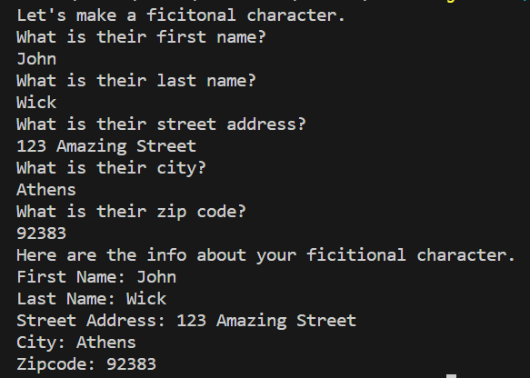

# Character Printer
A simple Java program that output the details of a character given the input.

## Overview
The Character Printer is a simple Java application that allows users to input information about a fictional person and then prints each piece of information on individual lines. It prompts the user to input the following details:

* First name
* Last name
* Street address
* City
* Zip code

After receiving the input, the application displays the entered information.

## Usage
1. Ensure you are in the correct directory of the source code.
2. Run ```javac CharacterPrinter.java``` to compile the code.
3. Run ```java CharacterPrinter``` to start the program.
4. When prompted, enter the first name of the character.
5. Then enter the following prompt for last name, street address, city, and zip code.
6. View the respond returned based on given input.

## Example


## Note
The first name, last name, street address, and city are taken as string input while the zip code is taken as a integer.