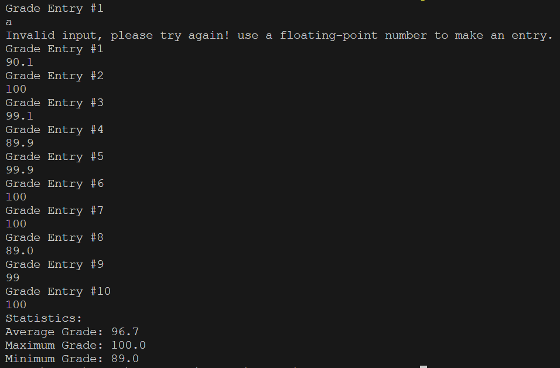

# Grade Calculator
A simple Java program that calculate grades.

## Overview
This Java program calculates important statistics for grades entered by the user. It prompts the user to enter ten floating-point grades and then calculates the average, maximum, and minimum grades. This program is useful for teachers or students who need to quickly analyze a set of grades.

## Usage
1. Ensure you are in the correct directory of the source code.
2. Run ```javac GradeCalculator.java``` to compile the code.
3. Run ```java GradeCalculator``` to start the program.
4. Follow the prompts to enter ten floating-point grades when prompted. Ensure that each grade is entered as a valid floating-point number.
5. After entering all grades, the program will display the calculated statistics, including the average, maximum, and minimum grades.

## Examples


## Note
Grades should be entered as floating-point numbers. The program will not terminate until ten valid grades are entered.