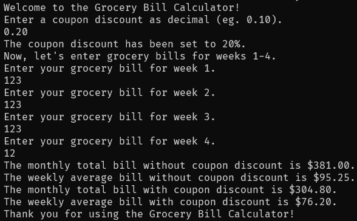

# Grocery Bill Calculator
A simple java program to calculate an overview of grocery bills in terms of weekly and monthly.

## Overiew
This Java program allows users to calculate the average weekly and monthly grocery bill for a family of four, although it could be for more or fewer members. It prompts the user to input a discount coupon amount as a decimal (e.g., 0.10 for 10%). If the entered value exceeds 100% or is less than or equal to zero, the program automatically sets the discount to 10%.

The program then prompts the user for the grocery bills for weeks 1 to 4. It calculates both the monthly and weekly averages for groceries. The monthly total and weekly average are displayed both with and without the coupon.

## Usage
1. Ensure you are in the correct directory of the source code.
2. Run ```javac GroceryBillCalculator.java``` to compile the code.
3. Run ```java GroceryBillCalculator``` to start the program.
4. When prompted, enter the discount coupon amount as a decimal.
5. Enter the grocery bills for weeks 1 to 4 when prompted.
6. View the calculated monthly total and weekly averages, both with and without the coupon.

## Example


## Note
If the discount coupon amount entered exceeds 100% or is less than or equal to zero, it will be automatically set to 10%.