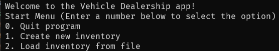
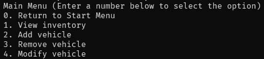
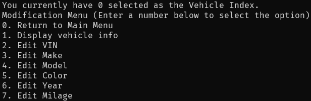
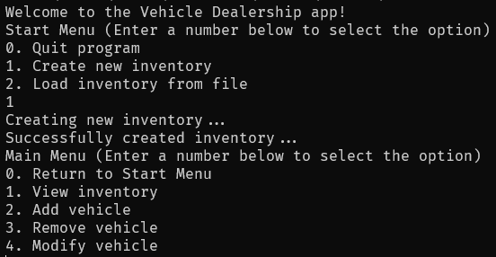
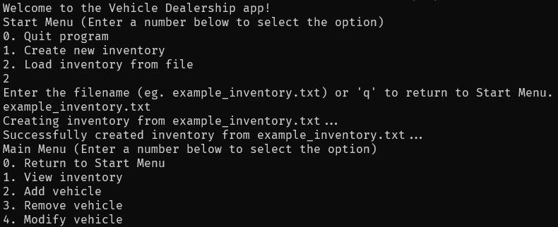

# Vehicle Dealership
A simple vehicle dealership management program made in Java.

## Overview
This Java program allows the user to manage a vehicle dealership on a very basic level. It includes functionality such as displaying all vehicle records, adding and removing vehicle records, and modifying vehicle records. Additionally, it provides the ability to save the records to a file, which can be used later to persist data.

## Usage
1. Ensure you are in the correct directory of the source code.
2. Run ```javac Vehicle.java VehicleInventory.java VehicleDealershipApp.java VehicleDealership.java``` to compile the code.
3. Run ```java VehicleDealership``` to start the program.
4. Carefully read each options provided at each menu.
5. When prompted input option given at a given menu to interact with it.

## Examples
Start Menu

Main Menu

Modification Menu

Create Inventory

Load Inventory


## Note
One thing to note is that in this app, the keyword "q" is utilized extensively to return to prior menus. Thus, it is recommended to avoid using the keyword "q", along with others like "-1", which perform similarly to "q". It is also recommended to quit the app properly via the menu options; otherwise, it may result in unintended behaviors.